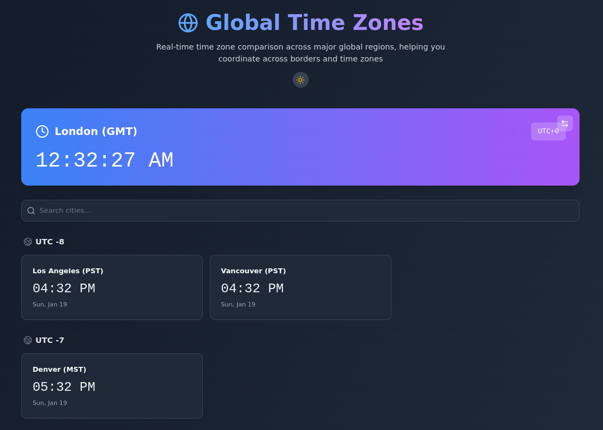

# Global Time Zones

[](https://opensource.org/licenses/Apache-2.0)  [](https://reactjs.org/)  [](https://www.typescriptlang.org/)  [](https://vitejs.dev/)  [](https://tailwindcss.com/)

Web application for real-time time zone comparison across major global regions.

## Features

- Real-time time zone comparison across 30+ major global cities
- Beautiful, responsive design that works on all devices
- Dark/light mode with system preference detection
- Instant search functionality for quick city lookup
- Fast and efficient with optimized performance
- Mobile-first approach for the best experience on all devices
- Grouped time zones by UTC offset for easy reference
- Smooth animations and transitions



## Getting Started

### Prerequisites

- Node.js 18.x or higher
- npm 9.x or higher

### Installation

1. Clone the repository:

   ```bash
   git clone https://github.com/yourusername/global-time-zones.git
   cd global-time-zones
   ```
2. Install dependencies:

   ```bash
   npm install
   ```
3. Start the development server:

   ```bash
   npm run dev
   ```
4. Open your browser and visit `http://localhost:5173`

## Building for Production

To create a production build:

```bash
npm run build
```

The built files will be in the `dist` directory.

## Technology Stack

- **React 18** - UI Framework
- **TypeScript** - Type Safety
- **Tailwind CSS** - Styling
- **Vite** - Build Tool
- **Lucide React** - Icons

## Project Structure

```
src/
├── components/         # React components
├── context/           # React context providers
├── types/             # TypeScript type definitions
├── App.tsx           # Main application component
└── main.tsx          # Application entry point
```

## Creator

Ed Bates (TECHBLIP LLC)

## Acknowledgments

Some sections of this code were generated with the assistance of AI tools.   These contributions were reviewed and integrated by the project creator(s).

## License

Apache-2.0 License - see the [LICENSE](LICENSE) file for details
